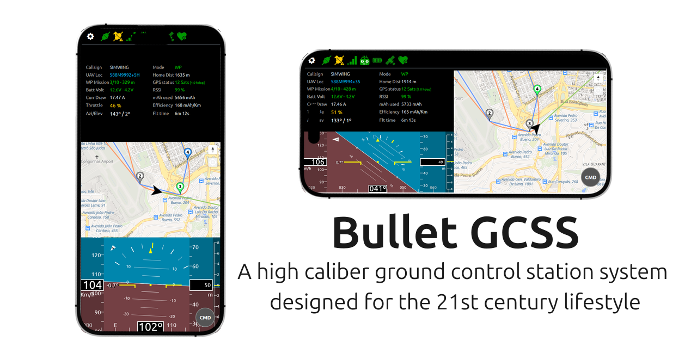

# Bullet GCSS
Bullet GCSS is a high caliber ground control station system designed for the 21st century lifestyle.

Bullet GCSS allows an UAV pilot/operator to get the most important telemetry data right on his/her SmartPhone or computer screen. Information such as aircraft location, distance, altitude, battery status, navigation status are always available.

The main differences between Bullet GCSS and other traditional ground station systems are:

 - It works using Cellular Data network, which means that there's no maximum range. You'll know about your aircraft as long as it's inside a the cellular network coverage area.
 - It doesn't require any app to be installed on your SmartPhone or computer. It's just a Web page that opens directly inside the Web Browser.
 - Bullet GCSS can also be installed on the SmartPhone as a Web App, giving the same experience but taking the full SmartPhone screen, making it look even nicer!
 - It works both on Android Phones/Tablets and iPhone/iPad, works on any PC too (Windows, Linux, Mac). In fact, it probably works on your Windows Phone too. That's the beauty of Web Apps.

## How it works?
There are two fundamental parts on Bullet GCSS: The **Modem** and the **User Interface (UI)**.

Modem talks to the Flight Controller on the aircraft to get the telemetry data, and sends this data to a MQTT Broker on the Internet. The channel is **bidirectional** — the UI can also send signed commands to the aircraft to toggle flight modes: Return to Home, Altitude Hold, Cruise, Waypoint Mission, Position Hold, and Beeper. All commands are authenticated with Ed25519 signatures so that nobody else can send commands to your aircraft, even on a public broker.

> **Requires INAV 9 or newer** on the flight controller.

The UI is connected to this same MQTT Broker, and every time it gets a new telemetry message, it'll display it on the screen.

Check out this [Demonstration Video](https://youtu.be/Iwv_Eo0fOuc?si=-nH5KV7GBwPIXf3V&t=623), action starts at 10:23.

## ⚠ Security Notice

By default, Bullet GCSS uses a **public MQTT broker** (`broker.emqx.io`). This means:

- Your aircraft's **real-time GPS location**, altitude, battery, and all other telemetry is visible to **anyone** who subscribes to the same topic.
- Anyone who knows your topic string can read your flight data while you fly.

For most hobby flights this is an acceptable trade-off, but you should be aware of it before flying in sensitive locations or with identifiable callsigns.

**If privacy matters to you:** It is straightforward to run your own private MQTT broker. See [How to self-host a MQTT Broker](docs/Self-Hosting-a-MQTT-server--(broker).md).

**Commands are protected:** Even on a public broker, nobody can send commands to your aircraft. All downlink commands are authenticated with Ed25519 digital signatures — the firmware rejects any command that is not signed with the key you generated and flashed.

## How can I use it?

- [What do I need?](docs/Required-hardware.md)
- [How to configure the modem device?](docs/Setup-modem.md)
- [How to install the modem device on my aircraft?](docs/Wiring.md)
- [How to Host the UI?](docs/Host-the-user-interface.md)
- [How to configure the UI?](docs/User-Interface.md)
- [How to find a MQTT Broker](docs/Find-a-MQTT-Broker.md)
- [How to self-host a MQTT Broker](docs/Self-Hosting-a-MQTT-server--(broker).md)
- [How much data will Bullet GCSS use?](docs/How-much-will-Bullet-GCSS-use-from-my-GPRS-data-plan?.md)
- [How to install Bullet GCSS on a SmartPhone](docs/How-to-install-Bullet-GCSS-on-SmartPhone.md)
- [Terrain elevation feature](docs/Terrain-elevation.md)
- [Communication Protocol Reference](docs/BulletGCSS_protocol.md)
- [Monitoring multiple aircraft simultaneously](docs/Multi-aircraft-monitoring.md)
- [Mission Planner](docs/User-Interface.md#mission-planner)
- [Troubleshooting](docs/Troubleshooting.md)
