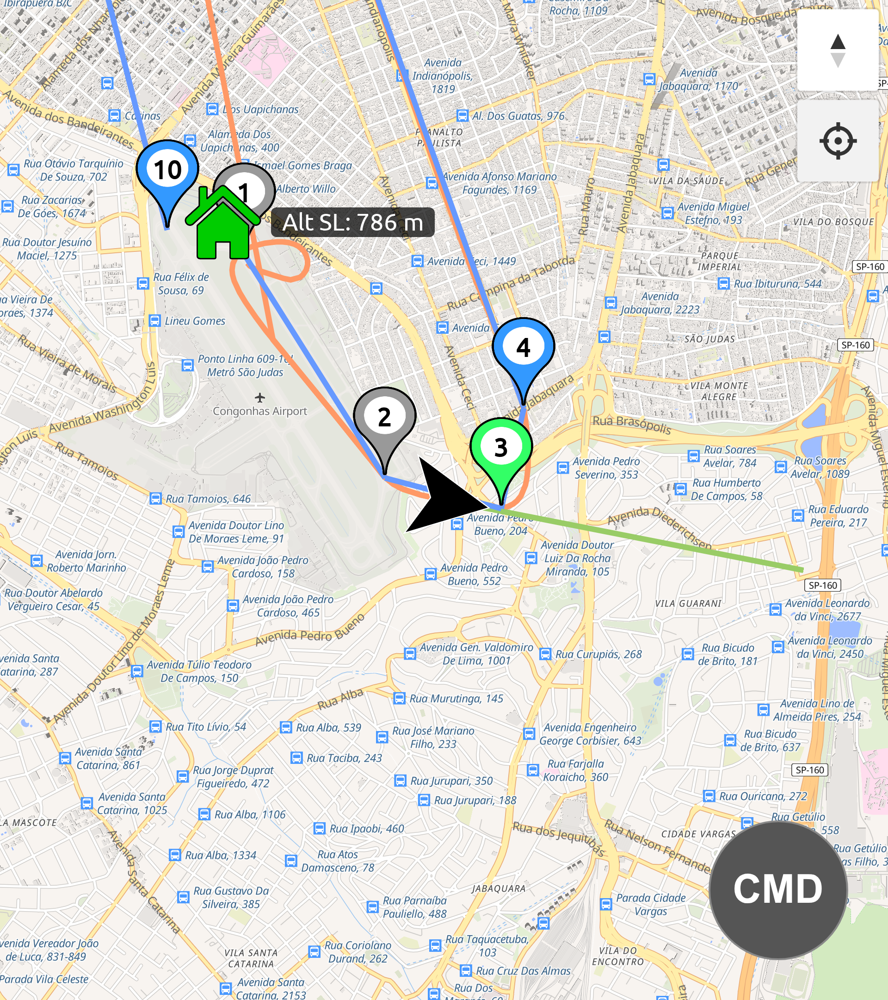
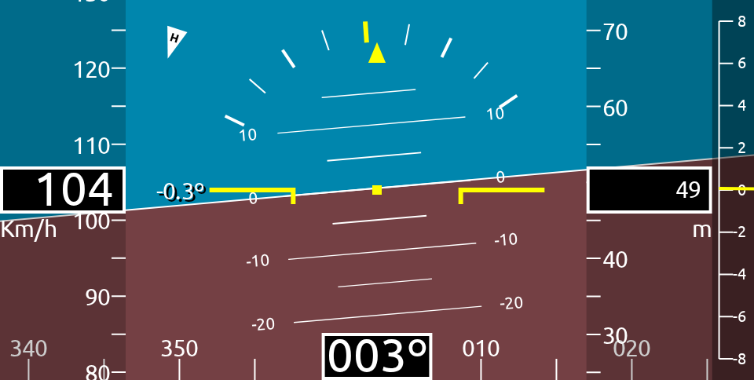
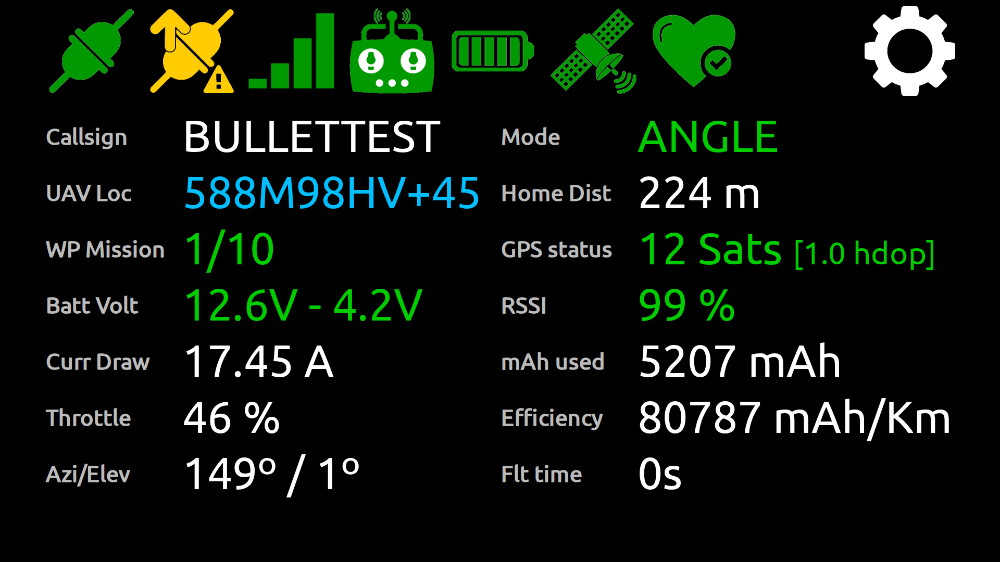

# Bullet GCSS
Bullet GCSS is a high caliber ground control station system designed for the 21st century lifestyle.


Bullet GCSS lets a UAV pilot monitor and command their aircraft from any smartphone or computer, over the cellular network — no range limit, no app to install.

> **Requires INAV 9.0.0 or newer** on the flight controller.

Check out this [Demonstration Video](https://youtu.be/Iwv_Eo0fOuc?si=-nH5KV7GBwPIXf3V&t=623) (action starts at 10:23).

---

## Key Features

- **Unlimited range** — works over cellular data, not radio. Your aircraft is reachable anywhere inside mobile network coverage.
- **No app required** — runs entirely in the browser as a PWA. Works on Android, iPhone/iPad, and any desktop (Windows, Linux, macOS).
- **Real-time telemetry** — GPS map with flight path, EFIS instruments (artificial horizon, heading, altitude, speed), battery status, navigation state, signal strength, and more.
- **Mission Planner** — plan, upload, and download full waypoint missions directly from the browser. Terrain elevation data is shown per waypoint.
- **Remote commands** — toggle flight modes (RTH, Altitude Hold, Cruise, Waypoint Mission, Position Hold, Beeper) and send navigation commands (Set Course, Jump to Waypoint) from the UI. All commands are authenticated with Ed25519 digital signatures.
- **Multi-aircraft monitoring** — monitor multiple aircraft simultaneously from a single browser session.
- **Multi-operator support** — export and import your signing key pair (password-protected PEM) to control the same aircraft from multiple devices.
- **Session recording** — flight sessions are recorded in the browser and can be replayed later.

---

## How It Works

Bullet GCSS has two components:

**Modem** — an ESP32 board mounted on the aircraft. It reads telemetry from the flight controller via MSP v2 and publishes it to an MQTT broker over WiFi or a cellular modem (SIM800 / SIM7600). It also receives signed downlink commands from the UI and forwards them to the flight controller.

**UI** — a static web page (no server-side code) that subscribes to the same MQTT broker and displays the incoming telemetry in real time.

```
Flight Controller (INAV)
  → MSP v2 (UART)
  → ESP32 Modem
  → MQTT Broker (WiFi or cellular, TLS encrypted)
  → Browser UI (any device, anywhere)
```

---

## Screenshots

| Map view | EFIS instruments |
|---|---|
|  |  |

| Telemetry panel | Mission Planner |
|---|---|
|  |  |

---

## ⚠ Security Notice

By default, Bullet GCSS uses a **public MQTT broker** (`broker.emqx.io`). This means:

- Your aircraft's real-time GPS location, altitude, battery, and all other telemetry is visible to **anyone** who subscribes to the same topic.
- Anyone who knows your topic string can read your flight data.

For most hobby flights this is an acceptable trade-off, but be aware of it before flying in sensitive locations or with identifiable callsigns.

**If privacy matters to you:** It is straightforward to run your own private MQTT broker. See [How to self-host a MQTT Broker](docs/Self-Hosting-a-MQTT-server--(broker).md).

**Commands are protected regardless:** Even on a public broker, nobody else can send commands to your aircraft. All downlink commands are authenticated with Ed25519 digital signatures — the firmware rejects any command that is not signed with your key.

---

## Getting Started

- [What hardware do I need?](docs/Required-hardware.md)
- [How to configure the modem device](docs/Setup-modem.md)
- [Wiring the modem to the flight controller](docs/Wiring.md)
- [How to host the UI](docs/Host-the-user-interface.md)
- [How to configure the UI](docs/User-Interface.md)
- [Finding a MQTT broker](docs/Find-a-MQTT-Broker.md)
- [Self-hosting a MQTT broker](docs/Self-Hosting-a-MQTT-server--(broker).md)
- [How much cellular data will Bullet GCSS use?](docs/How-much-will-Bullet-GCSS-use-from-my-GPRS-data-plan?.md)
- [Installing Bullet GCSS as a smartphone web app](docs/How-to-install-Bullet-GCSS-on-SmartPhone.md)
- [Terrain elevation feature](docs/Terrain-elevation.md)
- [Monitoring multiple aircraft simultaneously](docs/Multi-aircraft-monitoring.md)
- [Mission Planner](docs/User-Interface.md#mission-planner)
- [Communication Protocol Reference](docs/BulletGCSS_protocol.md)
- [Troubleshooting](docs/Troubleshooting.md)
- [Development setup](docs/Development-setup.md)
