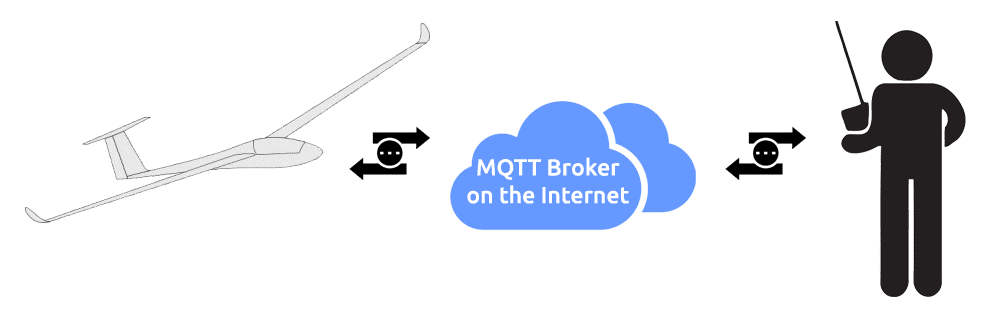

# Finding a MQTT Broker

The MQTT broker is the central relay between the aircraft and the user. The modem publishes telemetry messages to the broker, and the UI subscribes to the same broker and receives them in real time.

---

## What is MQTT?

MQTT is a lightweight publish/subscribe messaging protocol designed for IoT devices. It is optimised for low bandwidth, low code footprint, and unreliable networks — which makes it a natural fit for airborne telemetry over cellular. See the [official MQTT website](https://mqtt.org/) for more background.

---

## Default Broker

By default, Bullet GCSS uses the free public broker provided by [EMQX](https://www.emqx.io/) at `broker.emqx.io`.

### Modem configuration

Edit `Config.h` before [flashing the firmware](Setup-modem.md):

| Setting | Value |
|---|---|
| Host | `broker.emqx.io` |
| Port | `8883` (standard MQTT over TLS) |
| Username | any value |
| Password | any value |
| Topic | `bulletgcss/telem/<your-aircraft-name>` |

The topic must have at least 3 levels (e.g. `bulletgcss/telem/myplane`). The firmware uses this topic for uplink telemetry and a matching `bulletgcss/cmd/<your-aircraft-name>` topic for downlink commands.

### UI configuration

Open the Settings panel (gear icon) and choose **Broker settings**:

| Setting | Value |
|---|---|
| Host | `broker.emqx.io` |
| Port | `8084` (EMQX WebSocket over TLS) |
| Username | any value |
| Password | any value |
| Topic | same topic used on the modem |
| Use TLS | Yes |

> The modem and UI use different ports because they connect differently: the modem uses a native MQTT/TLS socket (port 8883), while the browser uses a WebSocket connection (port 8084). Both are encrypted. This is standard MQTT broker behaviour, not specific to EMQX.

Settings are saved in your browser's localStorage and restored on every subsequent visit.

---

## Public Broker Privacy Warning

`broker.emqx.io` is a public broker. Anyone who knows your topic string can subscribe to it and read your aircraft's GPS position, altitude, battery state, and all other telemetry. Choose a topic name that is not easily guessable if this is a concern.

> **Command security:** Even on a public broker, nobody can send commands to your aircraft. All downlink commands are signed with an Ed25519 private key; the firmware verifies the signature and silently drops anything with an invalid or missing signature. Replay attacks are also prevented — the firmware tracks the last accepted sequence number in NVS. However, the telemetry uplink is unauthenticated: anyone subscribed to your topic can read your flight data. For full privacy, use a private broker.

---

## Using a Different Broker

Any MQTT broker will work with Bullet GCSS. When evaluating a provider, check for:

- MQTT over TLS (port 8883 or equivalent) for the modem
- MQTT over WebSockets with TLS (port 8084 or equivalent) for the UI
- Username and password authentication
- No topic restrictions that would prevent a 3-level hierarchy
- Capacity for approximately **5,000 messages per hour per aircraft** (~500 KB/h at default settings) — this is a very low bar; MQTT brokers are designed to handle far higher loads

To self-host your own broker, see [Self-Hosting a MQTT Broker](Self-Hosting-a-MQTT-server--(broker).md).

Searching for "hosted MQTT broker" will return many commercial and free options.
