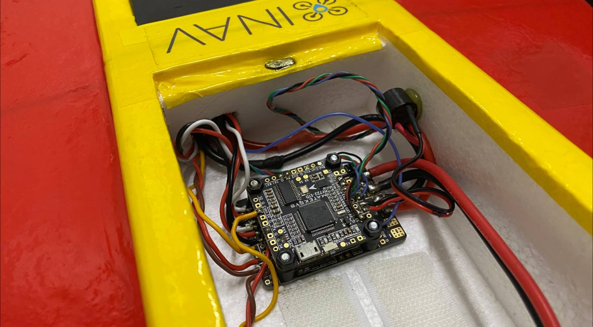
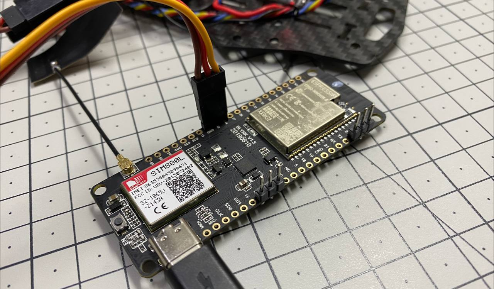
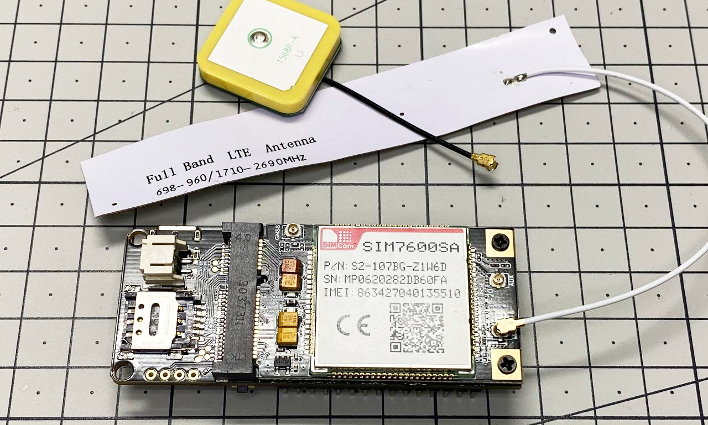
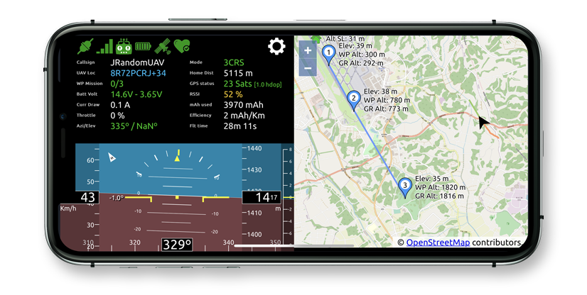

# Required Hardware

In order to use Bullet GCSS, you'll need:

- An aircraft with an INAV 9.0.0+ compatible flight controller
- An ESP32-based modem board with a cellular modem (see options below)
- A SIM card with a data plan
- A smartphone or computer with an internet connection

---

## Flight Controller

Bullet GCSS communicates with the flight controller via MSP v2 over a UART connection. It requires **INAV 9.0.0 or newer**.

Bullet GCSS does not fly the aircraft — that is entirely the flight controller's job. Bullet GCSS maintains a communication channel to the flight controller to exchange telemetry data and commands.

The flight controller must have at least one free UART to wire the modem to it.

If you need a flight controller recommendation, here are some well-regarded options:

- **Matek F405-Wing** — Good choice for fixed-wing aircraft. 5 UARTs, BEC for servos and electronics, OSD.
- **Matek F765-Wing** — Ideal for fixed-wing. 7 UARTs, 12 PWM outputs, plenty of processing power.
- **Matek F405-SE** — All-in-one for multirotors with standalone ESCs. 6 UARTs, 9 PWM outputs. Requires a separate BEC for the modem.
- **Matek F405-STD** — Works for both multirotor and fixed-wing. 5 UARTs, 7 PWM outputs, OSD. Requires an external 5V power supply.
- **Matek F722-MiniSE** — Compact option for multirotors with 4-in-1 ESCs. 5 UARTs, 8 PWM outputs. Requires a dedicated 5V regulator for the modem.

---

## Modem Board

The modem board is the device that sits on the aircraft and connects Bullet GCSS to the internet. Both supported boards are based on the **ESP32** microcontroller — a 32-bit dual-core MCU running at 240 MHz with 4 MB of flash and 8 MB of RAM, and onboard WiFi and Bluetooth LE.

> **WiFi mode:** The firmware also supports connecting via WiFi instead of a cellular modem. This is intended for bench testing and development only — it is not practical for actual flights.

### TTGO T-Call (SIM800L — 2G)

An inexpensive board combining an ESP32 and a SIM800L GPRS modem. The SIM800L is a quad-band 2G modem, operating at 850, 900, 1800, and 1900 MHz.

**Important:** 2G networks have been shut down in several countries (including the United States, Australia, Japan, and South Korea) and are being phased out in others. Before purchasing this board, verify that 2G coverage is available in your area. Despite its limitations, it remains a low-cost option where 2G is still operational.

### TTGO T-PCIE + SIM7600 Module (4G)

A more capable board with an ESP32 and a Mini-PCIe slot that accepts a SIM7600-series 4G LTE modem module. It supports both 2G and 4G networks, provides much better connectivity, and is the recommended choice for new builds.

The board and the SIM7600 module are sold separately. Choose the module variant for your region:

| Variant | Region |
|---|---|
| SIM7600SA | South America, Australia, New Zealand |
| SIM7600A | North America |
| SIM7600E | Europe, Middle East, Africa, Korea, Thailand |
| SIM7600JC | Japan |

---

## Smartphone or Computer

The recommended way to use Bullet GCSS is on a smartphone. It is convenient to have a small screen near the RC transmitter, and the smartphone also provides its own GPS location to the UI.

Any modern Android or iPhone works. The interface is a standard web page — open it in the browser like any other website. It can also be installed as a PWA (web app) for a full-screen experience.

A laptop or desktop works equally well if preferred.
