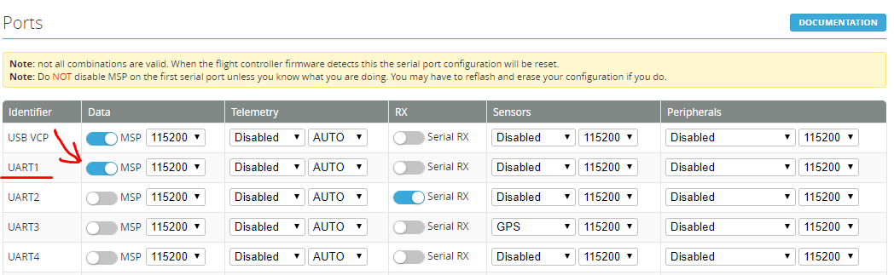
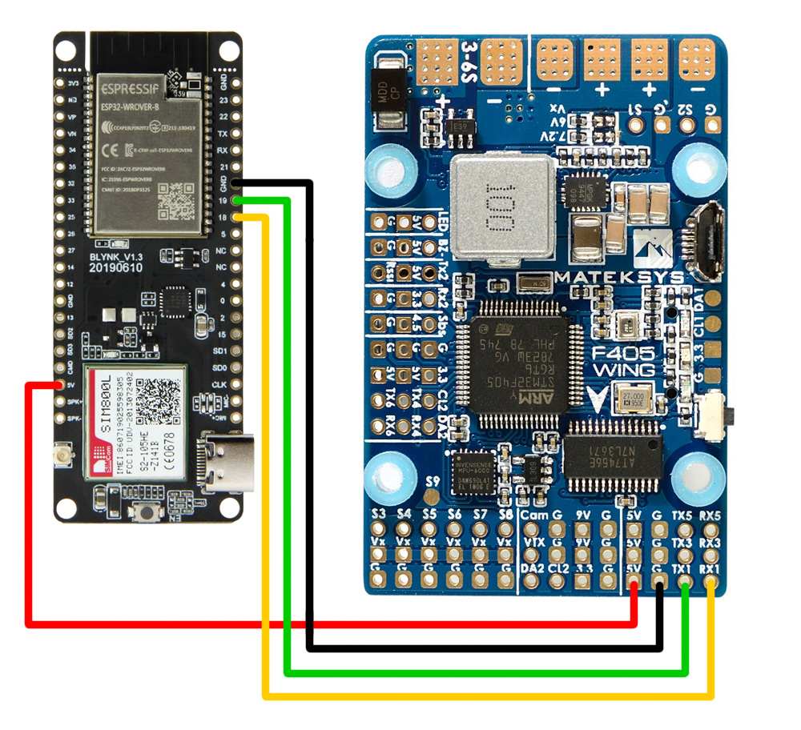
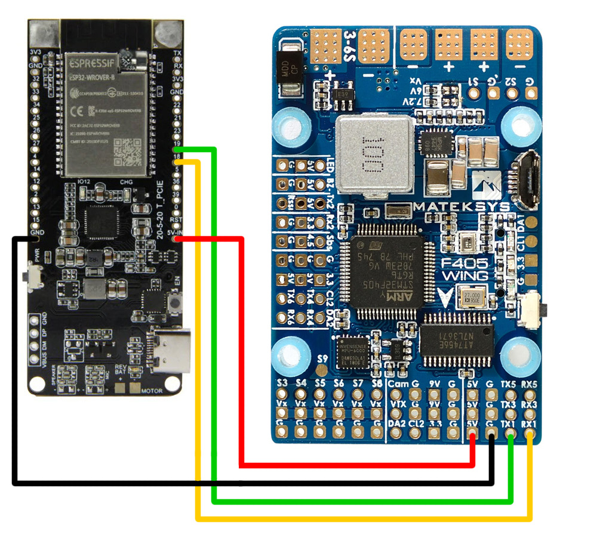
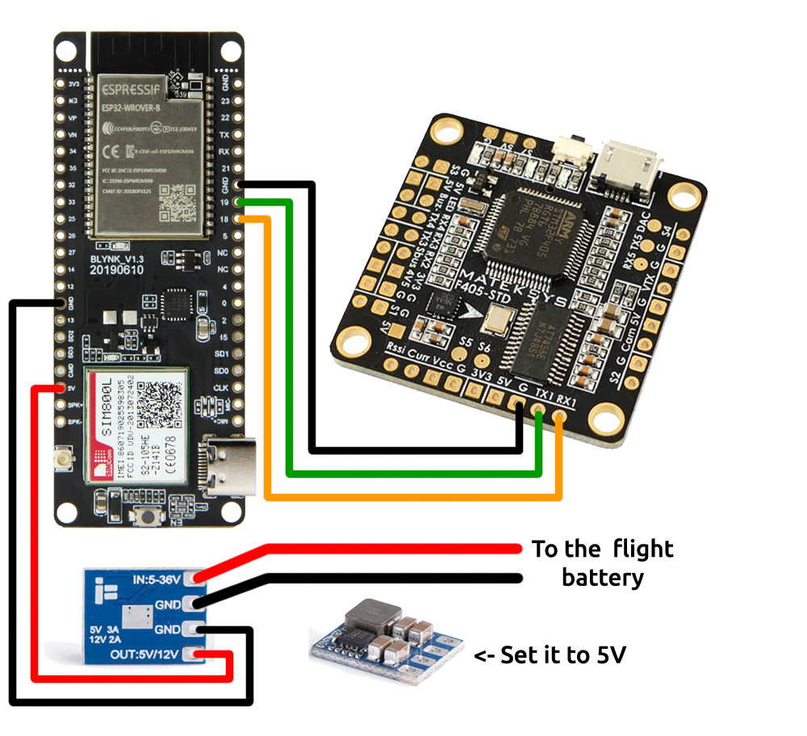
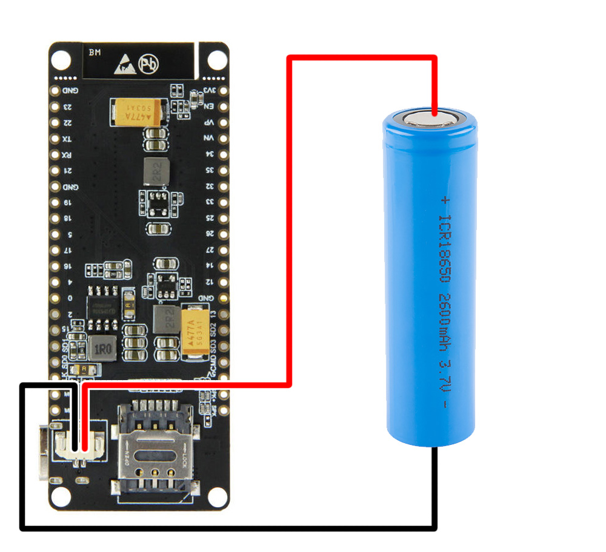

# Wiring

The modem board must be connected to the flight controller in order for Bullet GCSS to work.

---

## Step 1 — Configure a UART on the Flight Controller

The flight controller needs a free UART configured for MSP. Open the INAV Configurator, go to the **Ports** tab, and set the desired UART to **MSP** at **115200 baud**.

In this example, the modem will be wired to UART1 (TX1 / RX1 pins on the flight controller).

---

## Step 2 — Wire the Modem to the Flight Controller

Connect four wires between the flight controller and the modem board. You can solder directly or use pin headers.

> **Important:** TX and RX must be **crossed** — the TX pin on the modem connects to the RX pin on the flight controller, and the RX pin on the modem connects to the TX pin on the flight controller. This is standard serial wiring and a very common mistake to get wrong.

The modem's default serial pins are **GPIO 18 (TX)** and **GPIO 19 (RX)** on the ESP32 (Serial2). If you need to use different pins, update the `MSP_TX_PIN` and `MSP_RX_PIN` values in `Config.h` before flashing.

### TTGO T-Call (SIM800L)

### TTGO T-PCIE (SIM7600)

In these examples, both boards are wired to a Matek F405-Wing using UART1:

| Modem pin | Flight controller pin |
|---|---|
| Pin 19 (TX) | RX1 |
| Pin 18 (RX) | TX1 |
| GND | GND |
| 5V | 5V |

If you use a different UART, replace RX1/TX1 with the corresponding pins for that UART (e.g. RX3/TX3 for UART3, RX4/TX4 for UART4, and so on).

---

## Power Considerations

Both the TTGO T-Call and TTGO T-PCIE draw a significant amount of current when transmitting over the cellular network — up to **2 amps** during a transmission burst. **The board will not work reliably if powered only through its USB connector.** This is the most common reason for the modem appearing to work on the bench but failing to connect to the cellular network.

> WiFi mode works fine over USB power. Only cellular operation requires a proper power supply.

### Powering from the Flight Controller

The simplest approach is to power the modem from the flight controller's 5V rail. Make sure the flight controller's 5V regulator can handle the extra load. The Matek F405-Wing has a robust 5V BEC and can power the modem without issue. Other flight controllers with smaller regulators may not be able to.

### Powering from a Dedicated Regulator

If the flight controller cannot supply enough current, add a dedicated 5V / 2A voltage regulator and power the modem from it directly.

### Powering from a 1S Battery

Both TTGO boards have a 1S LiPo battery connector on the back. If you use this option, do **not** connect the 5V wire from the flight controller (but always keep the GND connection). The board includes a power management circuit that handles charging via the USB-C port and provides over-charge and over-discharge protection.

> **Note:** Bullet GCSS does not interact with the onboard power management chips (IP5306 on the T-Call, AXP192 on the T-PCIE). Powering from an external 5V regulator is the recommended approach for most builds.
