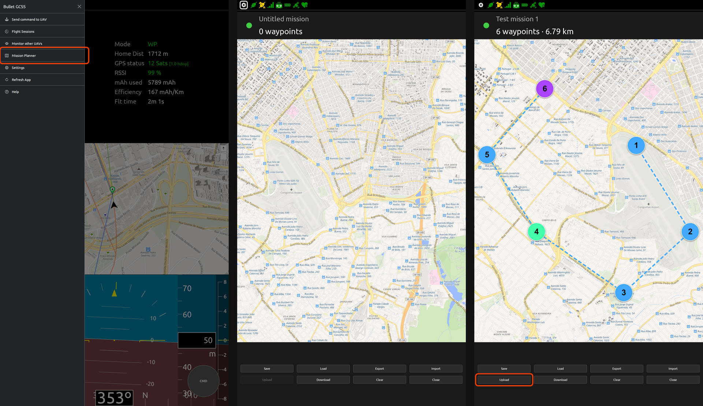

# Bullet GCSS — Release Notes v1.6

**Released:** 2026-03-31

---

## Overview

Version 1.6 is a major feature release focused on two long-planned capabilities: **multi-aircraft monitoring** and a full **waypoint mission planner**. Both features are fully functional end-to-end, from the web UI through the encrypted command channel to the ESP32 firmware and INAV flight controller.

---

## New Features

### Multi-Aircraft Monitoring (F1)

The UI can now subscribe to additional MQTT telemetry topics and display secondary aircraft on the same map alongside the primary aircraft.

- Each secondary aircraft is shown with a **colour-coded icon** (distinct hue per aircraft, using CSS filter colorisation) that rotates to match the GPS ground course.
- A **two-line label** shows callsign, altitude, vertical speed indicator (↑/↓), and ground speed — all respecting the user's unit settings (m/ft, km/h/mph/kt/m/s).
- A **course line** extends forward from each aircraft, showing one minute of projected travel at current speed.
- A **flight path** is drawn as a coloured line connecting all recorded positions.
- Aircraft that have not sent a message in more than 10 seconds are **dimmed to 50% opacity** to signal a stale connection.
- Tapping a secondary aircraft marker opens a **popup** showing last-seen time, Plus Code location (tap to copy), and a Stop tracking button.
- The monitored topic list is **persisted to localStorage** and automatically restored on reconnect.
- The **"Monitor other UAVs"** input field is pre-filled with the primary topic prefix (e.g. `bulletgcss/telem/`) for fast entry.
- No firmware changes required — secondary aircraft are read-only.

---

### Waypoint Mission Planner (F2)

A full-screen mission planning tool is now accessible from the sidebar menu.

#### Planning

- **Tap the map** to place waypoints. Each waypoint opens a parameter modal immediately.
- **Drag markers** to reposition — the route line updates in real time.
- **Waypoint modal** supports: Action (Waypoint / Loiter / RTH / Land), Altitude (m above home), Speed (m/s), and Loiter time (seconds).
- **Terrain elevation** is queried automatically from the configured provider when a waypoint is placed or a mission is loaded, showing ground elevation and estimated above-terrain clearance in the modal — updated live as the altitude input changes.
- **RTH constraint** enforced: RTH must be the last waypoint. Adding waypoints after an RTH is prevented. Changing a mid-mission waypoint to RTH prompts to delete subsequent waypoints.
- **Mission validity dot** in the top bar mirrors the `wpv` telemetry field — green when the FC reports the loaded mission as valid, red otherwise.
- **Waypoint count limit** enforced from the FC-reported `maxWaypoints` value (supports up to 254 waypoints on INAV).

#### File Management

- **Save / Load** missions to browser localStorage with custom names.
- **Export** missions as INAV-compatible JSON files (same format as INAV Configurator).
- **Import** INAV JSON mission files from device storage.

#### Upload to Aircraft

- Sends the planned mission waypoint-by-waypoint over the **encrypted Ed25519 command channel**.
- The firmware **buffers the entire mission** in a heap-allocated staging buffer before touching the FC — the flight controller's mission is only updated once all waypoints are received and validated.
- **Upload is blocked** if WP Mission mode or MSP RC Override mode is active on the aircraft.
- A **confirmation dialog** is shown if the aircraft is armed (mid-flight upload).
- Progress is shown per waypoint; upload can be cancelled at any time.

#### Download from Aircraft

- A new `getmission` command fetches the mission currently stored on the FC.
- The firmware sends each waypoint as a `dlwp:` telemetry message; the UI reassembles them into the planner.
- **Download is blocked** if WP Mission mode or MSP RC Override mode is active.
- A **confirmation dialog** is shown if the aircraft is armed.

---

## Firmware Changes (ESP32-Modem)

- **`cmd:setwp` handler** — receives waypoints one by one, buffers them in a heap-allocated staging array (sized to FC-reported `maxWaypoints`, supports up to 254 WPs), validates the full mission, then forwards to the FC via `MSP_SET_WP`. Checks that WP Mission mode is not active before forwarding.
- **`cmd:getmission` handler** — reads the current mission from the FC and publishes each waypoint as a `dlwp:` telemetry message. Uses heap allocation to avoid stack overflow on large missions.
- **`wpmax` telemetry field** — publishes the FC-reported maximum waypoint count at startup.
- **`wpv` telemetry field** — publishes the FC mission validity flag.
- **`dlwp:` message type** — new telemetry message type for mission download, distinct from the existing `wpno:` waypoint telemetry.

---

## UI / UX Improvements

- **Menu cleanup** — removed trailing `...` from all menu items; renamed "Send command" → "Send command to UAV"; renamed "Sessions" → "Flight Sessions".
- **Mission planner map** — no zoom buttons, no attribution overlay (cleaner appearance on mobile).
- **Close button** — removed the ✕ character from the Close button label in the mission planner.
- **Status icons** — connection and command channel icons are mirrored in the mission planner top bar so connectivity is visible without leaving the planner.

---

## Protocol Changes

- New downlink command: `cmd:setwp` — uploads a single waypoint (fields: `wpno`, `la`, `lo`, `al`, `ac`, `p1`, `p2`, `p3`, `f`).
- New downlink command: `cmd:getmission` — requests a full mission download from the aircraft.
- New telemetry message type: `dlwp:` — carries one waypoint per message during mission download.
- New telemetry fields: `wpmax` (max waypoint count), `wpv` (mission validity).

See [BulletGCSS_protocol.md](BulletGCSS_protocol.md) for full field reference.

---

## Documentation

- [User-Interface.md](User-Interface.md) — full Mission Planner section, Monitor Other UAVs section, updated sidebar menu reference, new screenshots.
- [BulletGCSS_protocol.md](BulletGCSS_protocol.md) — `setwp`/`getmission` command reference, `dlwp:` message type and field reference, Mission Upload and Mission Download protocol descriptions.
- [TODO.md](TODO.md) — F1 and F2 marked completed; F2 planning notes updated to reflect heap allocation and all implemented guards.

---

## Screenshots

---

## Upgrade Notes

- **Firmware re-flash required** for mission planner and download features (`cmd:setwp`, `cmd:getmission`, `dlwp:` support).
- No `Config.h` changes required unless updating MQTT topics or adding a new key pair.
- The Ed25519 key pair from v1.5 remains valid — no need to regenerate.
- INAV 9 or newer required (unchanged from v1.5).
