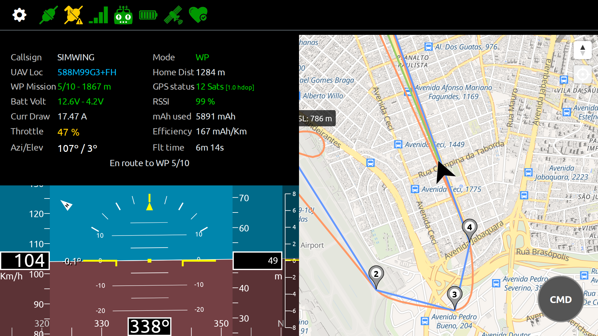
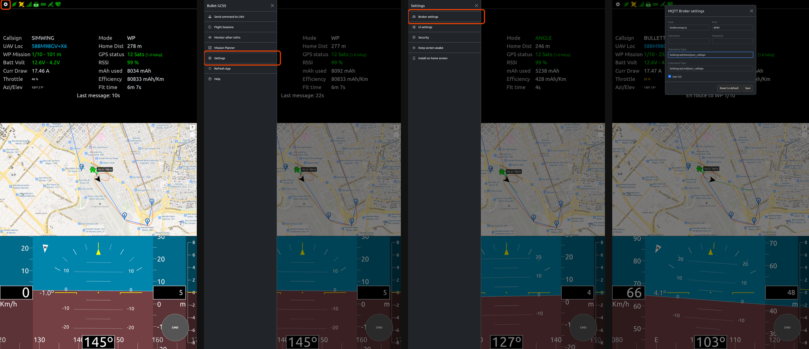

# Bullet GCSS — Release Notes v1.7

**Released:** 2026-04-05

---

## Overview

Version 1.7 is a major UI overhaul — a complete rebuild of the web interface on **Bootstrap 5**, bringing a cleaner, more consistent look and better mobile usability. Alongside the redesign, several rendering and display-quality improvements were made for high-DPI screens.

No firmware changes are required to upgrade from v1.6.

---

## New Features

### Bootstrap 5 UI Migration

The web interface has been fully rebuilt on **Bootstrap 5.3.8**. The page layout, navigation, and controls now use Bootstrap components throughout, replacing the bespoke CSS-panel system from earlier versions.

**Layout:**
- **Portrait mode:** Info panel → Map → EFIS, stacked in equal thirds (in that order).
- **Landscape mode:** Info panel + EFIS stacked on the left (50%), Map on the right (50%).
- A fixed-top **navbar** holds the gear icon (menu toggle) and the status icon bar — always visible regardless of scroll position.

**Navigation:**
- The sidebar menu is now a Bootstrap **offcanvas** panel that slides in from the left. Each menu item has a corresponding Bootstrap icon for quick visual identification.
- The menu button is a **gear icon** (`bi-gear-fill`) replacing the old hamburger.

**Settings:**
- **Broker settings**, **UI settings**, and **Security** are now full Bootstrap **modals** — they overlay the screen cleanly rather than sliding in as panels.

**Commands:**
- The commands panel is a Bootstrap **modal** accessible from the sidebar menu or the **CMD floating action button** in the bottom-right corner.

**Sessions and Monitor UAVs:**
- Both panels are now Bootstrap **offcanvases** that slide in from the left, matching the sidebar style.

**Mission planner:**
- The full-screen mission planner now opens below the navbar (not covering it), preserving access to the status icon bar while planning.
- The toolbar is now a **CSS grid** — 4 buttons per row in portrait, all 8 in a single row in landscape.
- The connection/command channel status icons have been removed from the planner top bar (they are always visible in the navbar). Only the mission validity dot remains.

---

### HiDPI / High-DPR Display Fixes

- **MapLibre markers and labels** no longer apply manual `window.devicePixelRatio` multiplications. MapLibre handles DPR internally on its WebGL canvas; DOM marker sizes are now in CSS pixels only.
- **EFIS canvas** rendering now uses `efis.PixelRatio = 1` for all drawing coordinates, since `ctx.scale(dpr, dpr)` handles the physical-to-CSS pixel mapping. Only the canvas element's physical size still reads `window.devicePixelRatio` live on each render.

These fixes prevent doubled/over-scaled markers and EFIS elements on high-DPI devices (e.g. Retina iPhones and MacBooks).

---

### Information Panel Font Improvements

- Cell headers (`tblDataViewCellHeader`) and value cells (`tblDataViewCellValue`) now use viewport-relative font sizing (`1.5vmax`) for consistent readability across screen sizes and orientations.
- Dynamic color changes (`color-ok`, `color-warning`, `color-danger`) now correctly preserve the `tblDataViewCellValue` class when applied at runtime, so the font size is not lost when cell colors update.

---

### Apple / PWA Meta Tags

All Apple-specific meta tags and splash screen links from the old UI are now present in the new `basicui.html`:
- `apple-mobile-web-app-capable`, `apple-mobile-web-app-title`, `apple-mobile-web-app-status-bar-style`
- All `apple-touch-icon` sizes (120×120 through 1024×1024)
- Portrait and landscape splash screens for all supported iPhone and iPad sizes
- OG/Twitter social meta tags and favicon

---

## UI / UX Improvements

- **Ubuntu font** loaded via Google Fonts CDN — consistent typography on all devices including iOS, which does not bundle Ubuntu.
- **Portrait panel order** corrected: Info → Map → EFIS (was Info → EFIS → Map before the fix).
- **Sessions and Monitor UAVs offcanvases** now open from the left side (matching the main menu), not the right.
- **Secondary aircraft labels** and **waypoint info labels** display correctly on the new page — required CSS classes were added to the inline stylesheet.

---

## Breaking Changes

None. All changes are UI-only. The firmware, MQTT protocol, and localStorage data formats are unchanged.

---

## Upgrade Notes

- **No firmware re-flash required.**
- The Ed25519 key pair from v1.6 remains valid.
- Browser localStorage settings (broker, units, map style, monitored topics, saved missions) are preserved automatically.
- The old UI is still accessible at `oldui.html` for reference during the transition period.

---

## Screenshots

